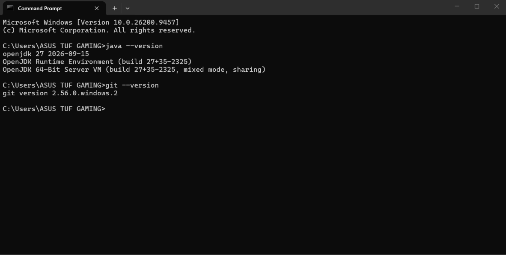
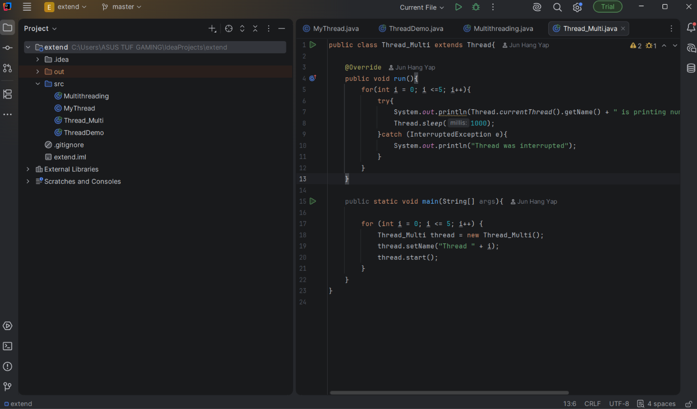

## Your Info:
1. 305763
1. Yap Jun Hang

## Instruction
1. Install the latest OpenJDK (LTS). Video --> [Java | How to install OpenJDK 15 on Windows 10](https://youtu.be/KaUeS5bwvCw)
1. Install IDE (for example, IntelliJ IDEA). Video --> [How to install IntelliJ IDEA on Windows 10 and test a Java Program](https://youtu.be/VwCma5_RKJE)
1. Install Git. Video --> [Git | How to install git on Windows](https://youtu.be/P1bh5qS63qQ)
1. The screenshot of the result/output must be displayed at your `Readme.md`.

## Screenshot of result/output
1. JDK & Git

2. IDE

